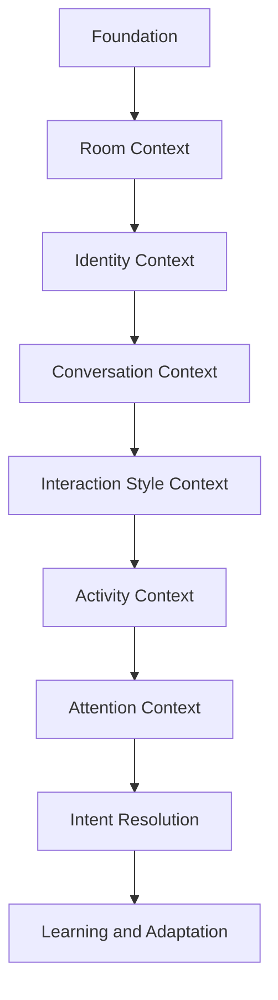
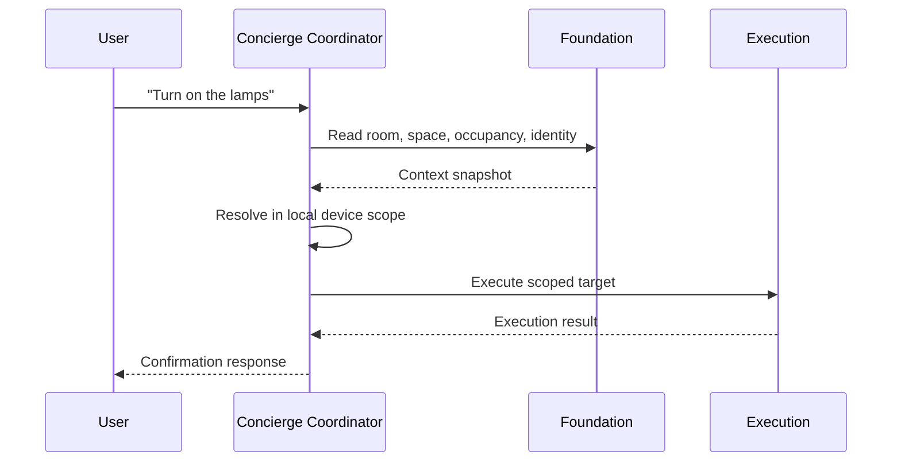

# Concierge Runtime Architecture

## Purpose

The Concierge Runtime Architecture defines how the Concierge system executes at runtime.

It describes:

- how voice input is processed
- how room context is resolved
- how signals and context are retrieved
- how actions are executed
- how interactions are generated

This document connects all contracts, models, and patterns into a single deterministic execution flow.

---

## Core Principle

The system must execute deterministically.

Once intent is known, the system must act immediately without runtime ambiguity.

---

## Concierge Architectural Position

Concierge is not fundamentally a voice assistant.

Concierge is a context engine.

Voice, dashboards, notifications, announcements, media experiences, and asset interactions are consumers of shared contextual understanding maintained by the Coordinator.

---

## Context Before Intent

Traditional systems attempt to determine meaning after a request is received.

Concierge continuously builds context before interaction occurs.

This allows:

- faster execution
- reduced ambiguity
- natural speech
- less cognitive effort
- more predictable behavior

This principle aligns with Homes That Behave Well values:

- Calm
- Predictable
- Context-Aware
- Human-Centered
- Transparent
- Trustworthy
- Low Cognitive Load
- Natural Interaction
- Progressive Intelligence
- Context Before Intent

---

## Architectural Hierarchy Of Context

Concierge is a layered context engine.

Architecture stack:

Foundation
  -> Room Context
  -> Identity Context
  -> Conversation Context
  -> Interaction Style Context
  -> Activity Context
  -> Attention Context
  -> Intent Resolution
  -> Learning And Adaptation

Suggested architecture diagram:



---

  ## Formal Architecture Section Pack

  This section pack defines governance-grade architecture policy for Concierge context layers.

  The objective is to preserve calm, predictable, context-aware behavior while allowing progressive intelligence over time.

  ---

  ## Layer Contract Standard

  Every layer must publish a formal contract with the following required fields:

  - Purpose
  - Allowed Inputs
  - Required Outputs
  - Decision Rights
  - Non-Rights
  - Freshness Policy
  - Explainability Payload
  - Failure Behavior

  No layer may operate without an explicit contract.

  ---

  ## Cross-Layer Governance Rules

  The layered model is strict by default.

  Rules:

  - lower-layer truth may not be overwritten by higher-layer inference
  - higher layers may narrow, weight, route, and personalize
  - higher layers may not rewrite foundational truth
  - any override attempt must emit an explicit governance event
  - every layer output must include confidence and expiration metadata

  Architectural intent:

  - reduce ambiguity
  - reduce runtime noise
  - preserve deterministic behavior

  ---

  ## Hybrid Freshness And Noise-Reduction Policy

  Freshness is hybrid.

  Primary update mode:

  - event-driven refresh on meaningful context change

  Secondary update mode:

  - TTL refresh as a stale-context safeguard

  Policy requirements:

  - event-driven updates are preferred over fixed polling
  - TTL values must minimize unnecessary recomputation
  - context churn must be treated as architectural noise
  - freshness tuning is successful only if cognitive load decreases

  Freshness objective:

  Calm interaction quality, not maximum update frequency.

  ---

  ## Room Posture And Response Modality Policy

  Room posture influences delivery modality.

  Posture examples:

  - nighttime
  - sleeping
  - reading
  - hosting
  - focused work

  Behavior requirements:

  - low-disturbance posture should reduce or suppress TTS
  - quiet posture should favor dashboard or visual delivery
  - audible responses should be short, high-value, and context-appropriate
  - modality choice must prioritize calm and low cognitive load

  Coordinator must treat posture as a first-class routing signal.

  ---

  ## Decision Rights Isolation Policy

  Each layer has one purpose and isolated decision rights.

  There should be no overlap in decision authority between layers.

  Policy requirements:

  - decision rights must be explicitly documented per layer
  - out-of-scope decisions must fail policy validation
  - cross-layer behavior must be reviewed and intentionally approved
  - boundary changes must be versioned as architecture updates

  Validation objective:

  Prove separation through execution traces and contract tests, then adjust deliberately.

  ---

  ## Explainability Representation Policy

  Explainability must exist in two forms.

  Machine form:

  - structured reason fields
  - confidence and factor weights
  - timestamps and source lineage

  Human form:

  - clear plain-language summary
  - concise rationale
  - no technical jargon unless the user context is technical

  Presentation requirement:

  Dashboard, UI, and voice output must always be human understandable.

  ---

  ## Respectful Redirect Policy For Foundation Conflicts

  When request context conflicts with local foundational truth, Concierge should redirect respectfully.

  Required behavior:

  - identify the likely target in another valid room or space
  - explain why local execution cannot occur in the current context
  - ask a clear confirmation question before cross-scope execution
  - preserve user agency and avoid abrupt rejection

  Reference pattern:

  "I think the lamp you mean is in another room. Do you want me to control it there?"

  Architectural principle:

  Respectful redirect is preferred over silent failure, silent reroute, or technical error language.

  ---

  ## Low-Confidence Emission And Feedback Learning Policy

  Low-confidence output may be emitted when the action is safe and reversible.

  Policy requirements:

  - low-confidence execution must be explicitly flagged
  - user-facing behavior must remain calm and understandable
  - feedback loop must capture outcome and corrections immediately
  - confidence must increase only with repeated positive evidence
  - confidence must decrease quickly on correction events
  - stale patterns must decay over time

  Learning guardrails:

  - transparent
  - predictable
  - reversible
  - explainable

  Learning objective:

  Increase confidence over time without introducing surprising behavior.

  ---

  ## Safety Gate By Action Class

  Action risk determines low-confidence behavior.

  Low-risk actions:

  - may proceed with low-confidence flag and feedback capture

  Medium-risk actions:

  - should use conservative defaults or concise confirmation

  High-risk actions:

  - require explicit confirmation before execution

  Safety objective:

  Progressive intelligence must not compromise trustworthiness.

  ---

  ## Contract Test And Proof Framework

  Architecture compliance must be provable.

  Required validation tracks:

  - layer boundary tests for decision-right isolation
  - freshness tests for event-driven plus TTL behavior
  - posture-routing tests for low-disturbance modality handling
  - explainability rendering tests for human readability
  - respectful-redirect tests for cross-room control requests
  - learning tests for confidence growth, decay, and reversibility

  Evidence artifacts should include:

  - decision trace
  - reason codes
  - human explanation output
  - correction and adaptation record

  ---

  ## Implementation Grounding And Scope

  This architecture is grounded in an active implementation path.

  Current implementation direction:

  - define room context as a first-class runtime primitive
  - define merged spaces from room relationships
  - define controllable device scope per room and per merged space
  - use Coordinator to process wake-word initiation and command handling

  Design intent:

  - deterministic outcomes
  - fastest reliable path to execution
  - minimal ambiguity at runtime

  ---

  ## Deterministic Fast Path

  Concierge should execute through a narrowed, pre-established path.

  Deterministic fast path:

  1. determine active room or interaction space
  2. load local controllable device scope
  3. resolve utterance inside that scope first
  4. execute immediately when resolution is unambiguous
  5. emit concise confirmation in posture-appropriate modality

  Runtime objective:

  move discovery work before command interpretation whenever possible.

  ---

  ## Multi-Assistant Arbitration: Listening Areas

  Current challenge:

  multiple voice assistants may hear the same wake-word event.

  Concierge must determine which assistant should respond and process.

  Listening Areas are the architectural construct for this arbitration.

  Listening Areas should evaluate:

  - room context and active interaction space
  - known presence and who is present
  - recent conversation ownership
  - activity and room posture
  - wake-word event locality and timing

  Arbitration requirements:

  - select one primary responder
  - suppress duplicate responders
  - keep ownership stable during conversation
  - learn from corrections and successful outcomes

  Learning objective:

  improve assistant selection confidence without introducing unpredictability.

  ---

  ## Relaxed Command Resolution

  Relaxed commands are allowed when local context is strong.

  Example:

  user says: "open the shade"

  expected behavior:

  - Concierge knows active room or interaction space
  - Concierge knows local shade entities in controllable scope
  - Concierge resolves target without requiring redundant room naming
  - Concierge executes immediately when unambiguous

  If ambiguity remains:

  - use respectful redirect or concise clarification
  - preserve calm interaction and user agency

  Architectural principle:

  users should not need to restate context the system already knows.

  ---

  ## Person Identity Sub-Project Integration

  Person identity and enrollment are defined as a dedicated Concierge sub-project.

  The sub-project is documented in person-identity-and-enrollment-architecture.md and linked contract, model, and pattern documents.

  Runtime integration goals:

  - determine likely speaker with explainable confidence
  - apply person-aware interaction style when confidence is sufficient
  - preserve deterministic action resolution using room and space scope
  - support explicit opt-in enrollment and revocation paths

  Setup integration goals:

  - support setup path selection for Rooms And Areas or People
  - represent people in people tiles similar to room tiles
  - allow preference setup before optional voice learning mode is enabled
  - support later updates through conversational learning and UI controls

  ---

## Layer 0: Foundation

Foundation is the source of truth.

Foundation owns:

- rooms
- spaces
- devices
- presence
- occupancy
- adjacency
- identity sources
- environmental state

Foundation answers: "What is true?"

Foundation does not make runtime decisions.

Foundation responsibilities are factual and descriptive.

---

## Layer 1: Room Context

Room Context is the foundation of Concierge runtime behavior.

Room Context determines:

- current room
- current merged space
- device scope
- room relationships
- adjacency
- presence
- occupancy

Examples:

- Primary Bedroom
- Primary Bathroom
- Laundry Room

Merged spaces:

- Great Room
  - Kitchen
  - Dining
  - Living Room
- Primary Suite
  - Bedroom
  - Bathroom
  - Closet

Room Context is the primary mechanism for:

- device scoping
- reduced ambiguity
- natural language interaction

Example:

Instead of:

"Turn on the bedroom lamps"

The user should be able to say:

"Turn on the lamps"

Because local room context already exists.

---

## Layer 2: Identity Context

Identity is not authentication.

Identity is behavioral context.

Identity Context personalizes interaction without fragmenting system behavior.

Different people may prefer different:

- responses
- notifications
- personalities
- asset descriptions
- dashboard presentations
- communication styles

Identity Context supports:

- personas
- preferences
- individual experiences

Example:

An art collector and a visitor may receive different descriptions of the same artwork.

---

## Layer 3: Conversation Context

Humans communicate in conversations, not isolated commands.

Once interaction begins:

- context remains active
- follow-up commands inherit previous context
- clarifications remain correctly scoped

Example:

"Turn on the lamps."
"Dim them."
"Make them warmer."

Conversation Context includes conversation ownership.

One interaction has:

- owner
- active room
- active space
- active subject
- timeout

The system should avoid unnecessarily re-evaluating context between commands.

---

## Layer 4: Interaction Style Context

Interaction Style Context determines how Concierge should communicate with the active person.

Style context may include:

- verbosity preference
- tone preference
- follow-up preference
- confirmation preference

Rules:

- style affects delivery, not truth
- style may not bypass safety confirmation policy
- room posture may suppress or reroute style output to reduce disturbance
- low-confidence identity should degrade to neutral style

---

## Layer 5: Activity Context

Activity Context extends understanding from where occupants are to what occupants are doing.

Examples:

- sleeping
- reading
- watching TV
- listening to music
- working
- cooking
- eating
- hosting guests
- relaxing
- away

Activity Context influences:

- announcements
- lighting
- notifications
- response styles
- interruption behavior

Activity Context is a future intelligence layer.

---

## Layer 6: Attention Context

Attention Context continuously determines:

"Where should my attention be focused?"

Attention is derived from:

- occupancy
- presence
- wake-word events
- activity
- identity
- recent interactions
- environmental awareness

Principle:

The home pays attention to people and spaces, not microphones.

The objective is not to determine which microphone heard a command best.

The objective is to determine where interaction is actually occurring.

---

## Layer 7: Intent Resolution

Intent Resolution operates on narrowed context produced by prior layers.

Intent Resolution should:

- resolve against contextual scope first
- avoid global ambiguity when local context is sufficient
- remain deterministic and explainable

Intent is interpreted after context has already constrained possibility space.

---

## Layer 8: Learning And Adaptation

Adaptive learning improves behavior through observation rather than explicit user training.

Examples:

- room corrections
- conversation corrections
- preference changes
- successful outcomes

Learning requirements:

- transparent
- predictable
- reversible
- explainable

Learning should never create surprising behavior.

---

## Interaction Space

Interaction Space is the formal area where interaction is occurring.

Examples:

- Primary Suite
- Great Room
- Guest Wing
- Open Living Area

Interaction Space may consist of:

- one room
- multiple rooms
- a merged space
- a dynamically determined area

Interaction Space narrows command resolution before intent processing begins.

Interaction Space is a Concierge Coordinator responsibility.

---

## Device Scope Resolution

The Coordinator maintains awareness of currently relevant devices by context.

Example: Primary Bedroom scope

- lamps
- lights
- shades
- speakers
- TV

Example: Great Room scope

- kitchen lights
- dining lights
- living room lamps
- living room TV

Principle:

Prefer Contextual Resolution over Global Resolution.

Local context should be evaluated before house-wide searches.

---

## State Awareness

State Awareness preserves important prior state so execution remains consistent.

Examples:

- lighting levels
- media volume
- playing media
- blind positions
- environmental conditions

Principle:

Restore where appropriate.

Example:

"Turn on lamps" may restore previous brightness rather than defaulting to 100%.

State Awareness contributes to consistency and predictability.

---

## Coordinator Responsibilities

Coordinator is the orchestration layer.

Coordinator owns:

- room context consumption
- identity application
- conversation ownership
- activity evaluation
- attention management
- intent resolution
- response routing
- notification routing
- learning

Coordinator answers: "What should happen?"

---

## Foundation Responsibilities

Foundation is the source of truth.

Foundation owns:

- rooms
- spaces
- devices
- presence
- occupancy
- adjacency
- identity sources
- environmental state

Foundation answers: "What is true?"

Foundation does not make decisions.

---

## Data Model Examples

The following examples are architectural reference models, not implementation-locked schemas.

### Context Layer Snapshot

```yaml
context_snapshot:
  foundation:
    room_id: primary_bedroom
    space_id: primary_suite
    occupancy:
      count: 1
      persons: [person.tom]
  room_context:
    local_device_scope:
      lights: [light.primary_bedroom_lamps, light.primary_bedroom_ceiling]
      covers: [cover.primary_bedroom_shades]
      media: [media_player.primary_bedroom_tv]
  identity_context:
    speaker: person.tom
    persona: default_resident
    communication_style: concise
  conversation_context:
    conversation_id: conv_202607010001
    owner: room.primary_bedroom
    active_subject: lights
    timeout_seconds: 30
  activity_context:
    current_activity: reading
    confidence: 0.82
  attention_context:
    focus_space: primary_suite
    confidence: 0.90
```

### Conversation Ownership Runtime Model

```yaml
conversation_runtime:
  conversation_id: conv_202607010001
  owner_room: primary_bedroom
  active_room: primary_bedroom
  active_space: primary_suite
  active_subject: lights
  established_at: 2026-07-01T08:00:00Z
  timeout_seconds: 30
  response_target:
    speaker_entity_id: media_player.primary_bedroom_speaker
```

### State Awareness Snapshot

```yaml
state_awareness:
  room_id: primary_bedroom
  last_known_state:
    lights:
      brightness_pct: 42
      color_temp_kelvin: 3200
    media:
      volume_level: 0.18
      source: "Spotify"
    covers:
      position_pct: 35
```

---

## Interaction Flow Examples

### Example 1: Local Context Compression

```text
Precondition:
- Active Room Context: Primary Bedroom
- Active Device Scope: bedroom lights, shades, speakers

User: "Turn on the lamps"
Coordinator:
1. Confirms active room context
2. Resolves "lamps" inside local scope
3. Executes target lights
4. Restores prior brightness if available
```

### Example 2: Multi-Turn Conversation Continuity

```text
User: "Turn on the lamps"
User: "Dim them"
User: "Make them warmer"

Coordinator behavior:
1. Maintains one conversation owner
2. Keeps active subject = lights
3. Applies each follow-up to same scoped targets
4. Expires context at timeout boundary
```

### Example 3: Attention Shift Across Space

```text
1. Great Room is active interaction space.
2. Occupancy and wake-word events shift to Primary Suite.
3. Attention Context confidence for Primary Suite rises above threshold.
4. New conversation ownership established in Primary Suite.
5. Intent resolution re-scopes to Primary Suite devices.
```

Suggested sequence diagram:



---

## Future-State Notes

- Activity Context should evolve from simple labels to confidence-weighted activity models.
- Attention Context should move from heuristic priority to transparent weighted scoring.
- Identity Context should support progressive personalization with hard safety bounds.
- Learning should maintain explicit correction logs and rollback capability.
- Context services should expose explainability payloads for UI and diagnostics.

---

## Architectural Vision

Concierge is not fundamentally a voice assistant.

Concierge is a context engine.

"Concierge is not fundamentally a voice assistant; it is a context engine. Voice is merely one consumer of the contextual understanding maintained by the Coordinator."

Voice, dashboards, notifications, announcements, media experiences, and asset interactions are consumers of the same contextual understanding.

Long-term objective:

Create a Home That Behaves Well by continuously establishing context before intent, reducing ambiguity before interaction, and allowing the home to behave more like an attentive concierge than a collection of disconnected devices.

---

## High-Level Flow

The Concierge runtime follows this lifecycle:

1. Input received (voice or UI)
2. Resolution (direct or Concierge)
3. Context determination (room or composite)
4. Capability retrieval (signals, context, execution targets)
5. Execution or response generation
6. Interaction update (if applicable)

---

## Input Sources

Inputs originate from:

- Voice (Home Assistant Assist or an external transport layer that forwards into Home Assistant)
- UI (Interaction panel or dashboard)
- Events (signal changes)
- Automations (internal triggers)

All inputs must enter the same execution pipeline.

---

## Resolution Layer

### Step 1: Voice Resolution

Voice input is first processed by Home Assistant.

Flow:

- Assist attempts to match entity name or alias
- If match is found:
  → direct entity service execution
- If no match:
  → forwarded to Concierge

---

### Step 2: Concierge Resolution

Concierge is responsible for:

- ambiguous commands
- multi-entity actions
- contextual queries
- signal-based requests

Examples:

- What should I do here
- Close everything
- Is the laundry done

Concierge must:

- resolve intent deterministically
- avoid guessing
- follow defined contracts

---

## Context Resolution

### Room Context

The system determines:

- area_id from invoking device
- room projection configuration

---

### Composite Context

If the resolved room belongs to a composite:

- promote to composite context

Rules:

- composite context overrides individual room scope
- must remain deterministic

---

## Runtime Model Assembly

The runtime model is assembled from preconfigured data.

It includes:

room_runtime_model:
  area_id:
  composite_id:
  execution_targets:
  audio:
  enabled_signals:
  global_overlays:
  entity_mappings:
  scene_bindings:

Rules:

- must be precomputed
- must not require runtime discovery
- must be consistent across executions

---

## Capability Retrieval

### Signals

Retrieved via:

- signal providers
- Signal Contract

Used for:

- household state
- actionable awareness

---

### Global Context

Retrieved via:

- context providers
- Global Context Contract

Used for:

- weather
- news
- email summaries

---

## Execution Path

All actions must follow execution patterns.

### Execution Hierarchy

1. Scene
2. Group
3. Direct entity control

---

### Execution Flow

If execution target is defined:

- call target directly

If not:

- fallback according to execution hierarchy

---

### Example

Command:
Close the shades

Execution:

- scene → scene.turn_on
- group → cover service call
- entity → batched entity control

---

## Audio Routing

Audio must follow strict priority:

1. preferred speaker
2. speaker candidates
3. voice device speaker fallback

Audio resolution must not delay execution.

---

## Interaction Generation

Interactions are generated when:

- signals change
- user requests information
- workflows begin

Interaction model:

interaction:
  id:
  type:
  source:
  summary:
  detail:
  actions:
  priority:
  expires_at:

Rules:

- interactions are ephemeral
- must not persist state
- must reflect system truth

---

## Voice + UI Parity

Both voice and UI must:

- invoke the same services
- use the same execution logic

Rules:

- UI must not bypass Concierge
- voice must not bypass execution patterns

---

## AI Integration

AI is optional and must be bounded.

### When AI is Allowed

- summarization
- disambiguation
- recommendations

---

### When AI is Not Allowed

- execution decisions
- service calls
- state interpretation

---

### AI Execution Flow

If deterministic path exists:

- execute immediately

If not:

- invoke AI (if enabled)
- produce structured result
- return to deterministic execution

---

## Event Handling

Signals may emit events:

- laundry.complete
- dishwasher.clean
- calendar.event_starting

Concierge must:

- evaluate context
- decide on interaction or notification
- avoid duplicate behavior

---

## Performance Requirements

The system must:

- avoid runtime entity discovery
- use precomputed configuration
- execute actions in a single call when possible
- avoid iterative loops

---

## Failure Handling

### Resolution Failure

If input cannot be resolved:

- return clear response
- do not guess intent

---

### Execution Failure

If execution target is unavailable:

- fallback to next strategy
- provide user feedback

---

### Data Failure

If signals or context are unavailable:

- degrade gracefully
- never fabricate results

---

## Security Model

The system must:

- respect integration boundaries
- avoid exposing sensitive configuration
- prevent unauthorized execution

---

## System Constraints

The system must:

- be deterministic
- be explainable
- be context-aware
- be fast

The system must not:

- rely on probabilistic execution
- perform hidden logic
- bypass defined contracts

---

## Final Principle

The runtime architecture defines how the system behaves in real time.

All interactions must follow:

- known context
- known capability
- known execution path

The system must never hesitate once intent is understood.